# Microsoft Sentinel SOC Lab

Built a Microsoft Sentinel SOC lab using an internet-exposed Azure Windows VM. Collected Windows Security Events, Sysmon, and PowerShell logs in Log Analytics using Azure Monitor Agent and Data Collection Rules. Used KQL to investigate the collected telemetry, developed and tuned detection rules, and built a Sentinel Workbook to visualise authentication attempts against the VM using IP geolocation data.

## RDP Honeypot

- Created an Azure Windows VM and exposed RDP to the internet.
  - Temporarily configured the Network Security Group (NSG) to allow inbound traffic.
    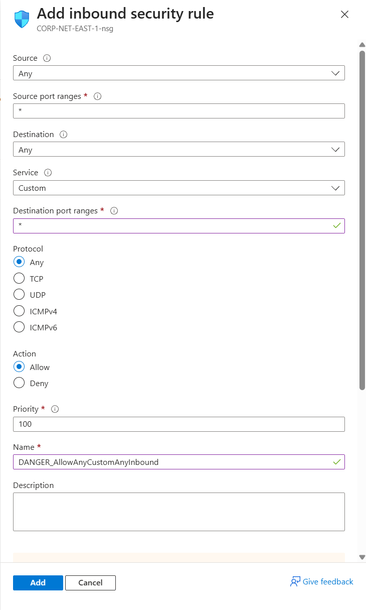
    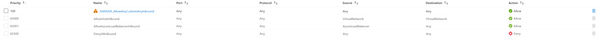
    
  - Temporarily disabled Windows Firewall profiles.

    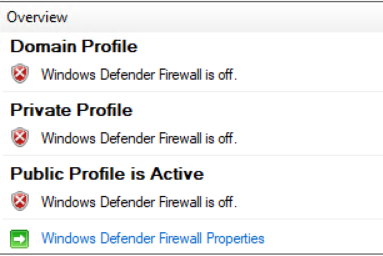

    
## Log Collection

- Created a Log Analytics Workspace (LAW) and installed Azure Monitor Agent (AMA) on the Windows VM.

  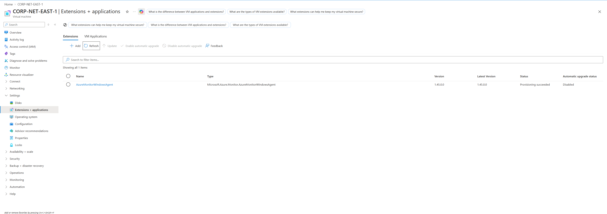

- Created a Data Collection Rule (DCR) to collect Windows Security Events and send them to the LAW.

  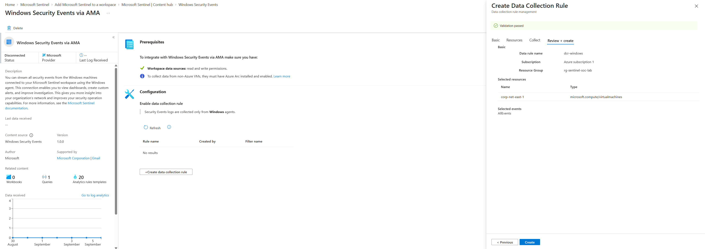

- Generated failed login attempts to verify log ingestion.

  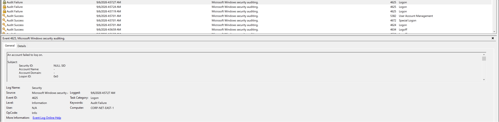

- Observed failed login attempts from unknown external IP addresses and used KQL against the `SecurityEvent` table to investigate the events and filter by fields including Event ID and source IP.

  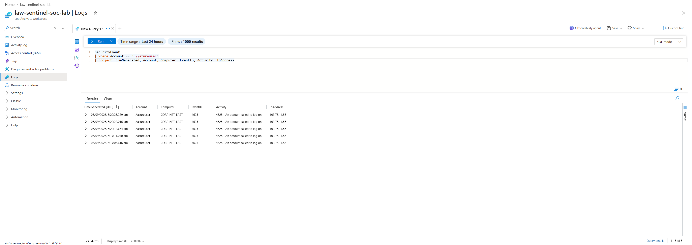

### Sysmon

- Installed and configured Sysmon on the Windows VM.

  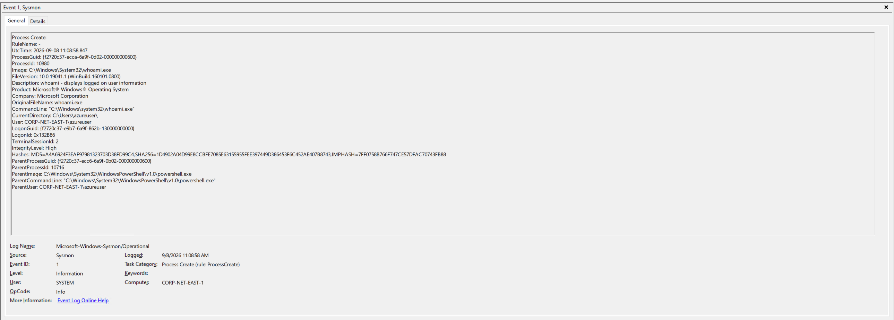

- Created a separate DCR for Sysmon events and verified successful ingestion into Log Analytics.
- Used KQL to query and analyse the collected Sysmon events.

  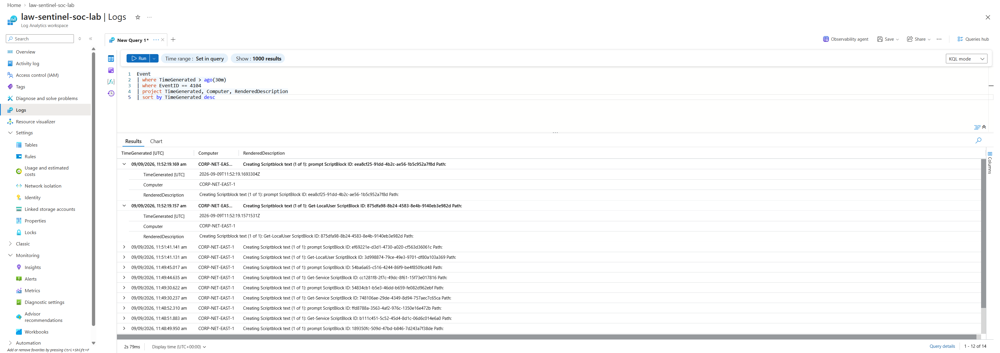

### PowerShell

- Collected PowerShell Script Block Logging events (Event ID 4104).
- Used KQL to query and analyse PowerShell execution data.

  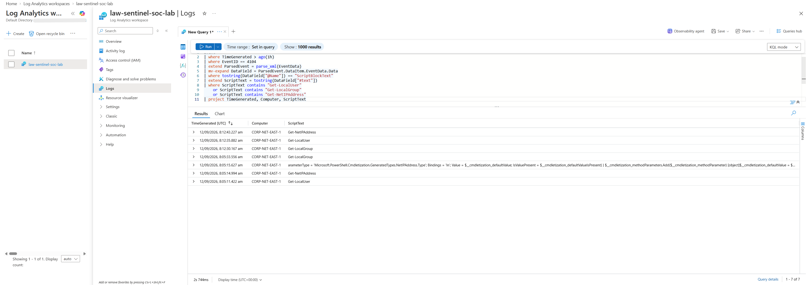

## Microsoft Sentinel

- Enabled Microsoft Sentinel on the Log Analytics Workspace.
- Used Sentinel to investigate the collected security telemetry.

  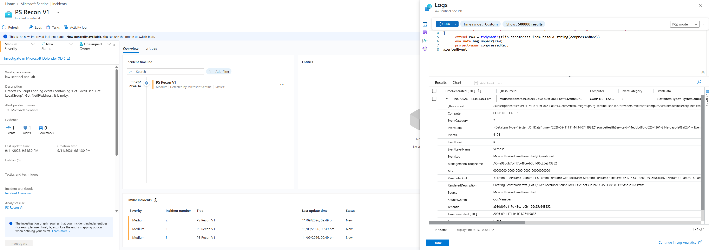

## Detection Rules

- Created a KQL detection for PowerShell reconnaissance using Event ID 4104.
- The initial detection searched PowerShell event data for reconnaissance commands but generated false positives from PowerShell module and framework code.

  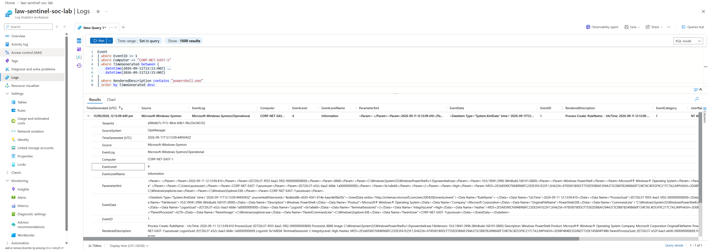

- Created a second version that parsed the `EventData` XML and extracted `ScriptBlockText` to target the executed script content and reduce noise.

  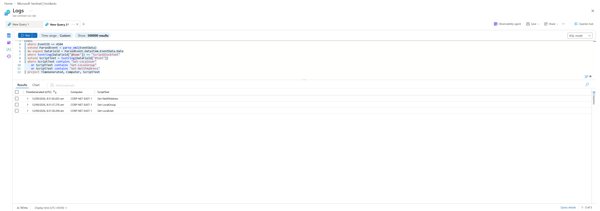

- Deployed both versions as Microsoft Sentinel Analytics Rules.

  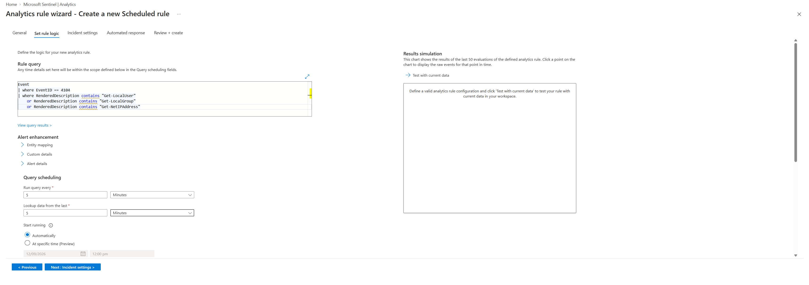

- Generated controlled PowerShell reconnaissance activity to test both rules and verify alert and incident generation.

  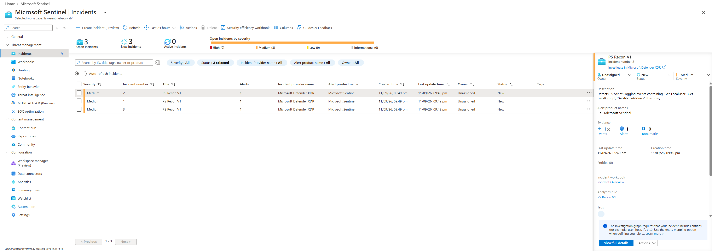

  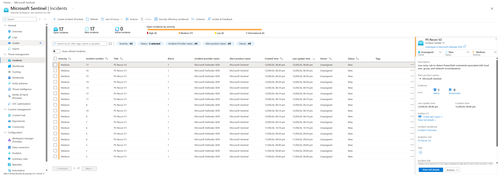

## Authentication Attempt Visualisation

- Created a Sentinel Watchlist containing IP geolocation data.
- Used the watchlist to enrich source IP addresses with geographic information.

  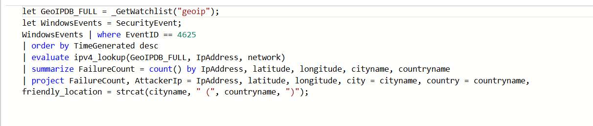

- Created a Sentinel Workbook to visualise the volume and geographic origin of authentication attempts against the VM.

  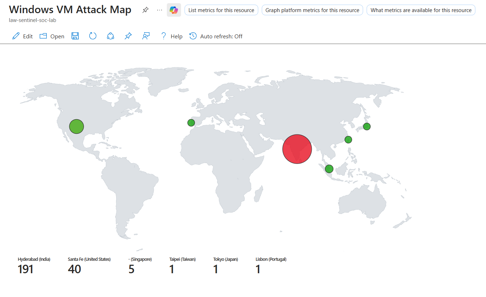
